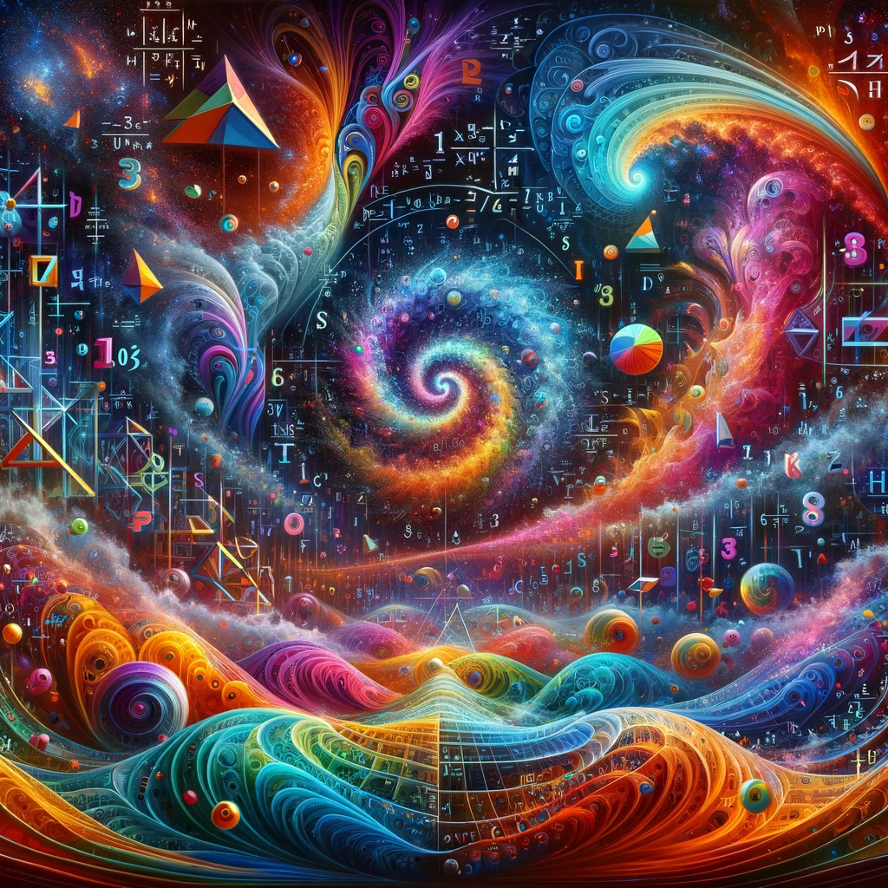
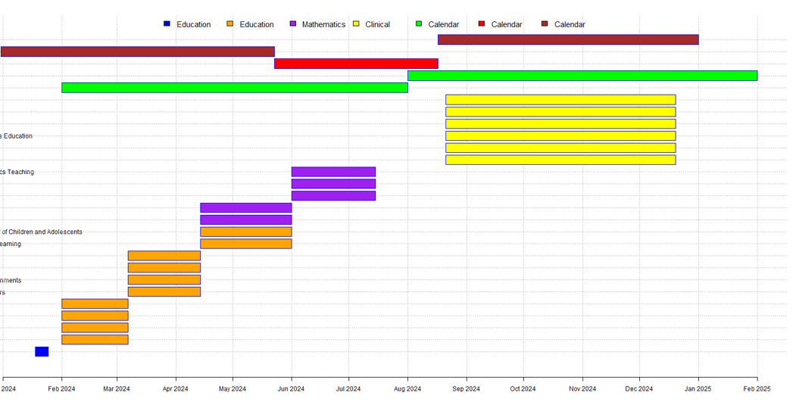
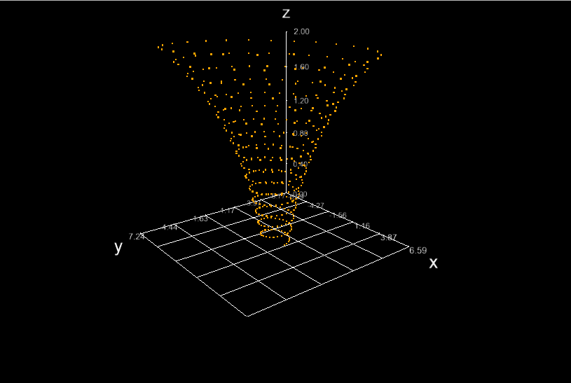

## Welcome to my GitHub profile
I use github to store, manage, track, and share coding projects, but at the moment all repositories are private. 

### About
- I’m currently working on becoming a licensed teacher  
- I have a long career background in engineering and technology  
- I’m currently obtaining an MA in Education and Teaching Mathematics  
- I’m working on educational projects and database tools for learning  
- I have started writing a Math Foundations book for elementary and high school Mathematics test preperation. The book is title Math Foundations and I currently use it for my own lessons but have no plans to publish yet (its unfinished). 

#### Programming Languages:
- **Python**: Experienced in data analysis, web development with frameworks like Django and Flask, scripting, and machine learning with libraries such as pandas, NumPy, scikit-learn, and TensorFlow.
- **JavaScript**: Proficient in front-end development with frameworks and libraries like React, Angular, and Vue.js, as well as server-side development with Node.js.
- **R**: Skilled in statistical analysis, data visualization with ggplot2, and report generation with R Markdown.

#### Markup and Style Sheet Languages:
- **HTML**: Solid understanding of HTML5 and semantic web design.
- **CSS**: Competent in styling web pages with CSS3 and pre-processors like SASS.

#### Databases:
- **SQL**: Capable of designing and managing databases, writing complex queries, and performance tuning in systems like MySQL, PostgreSQL, and Microsoft SQL Server.
- **NoSQL**: Familiar with document-oriented databases such as MongoDB and key-value stores like Redis.

#### Version Control:
- **Git**: Well-versed in using Git for version control, experienced with branching, merging, and working with remote repositories on platforms like GitHub.  

#### Data Analysis and Visualization Tools:
- **Tableau**: Knowledgeable in creating interactive data visualizations and dashboards.
- **Power BI**: Proficient in data modeling, analysis, and report creation.

#### Additional Tools and Frameworks:
- **Docker**: Understanding of containerization and experience in creating, deploying, and managing Docker containers.
- **Jupyter Notebooks**: Extensive use of Jupyter for interactive data analysis and sharing of results.
- **Webpack**: Experience in module bundling and asset management for web applications.
- **Bash/Shell Scripting**: Comfortable with command-line interfaces and writing shell scripts for task automation.

#### Technical Art
- **3d modeling**
- **Autocad**
- **Rhino**
- **Sketchup**
- **Unity**
- **Shaders development**

#### Latest Projects
- **Generative Art**: Searching for new patterns. The idea for the project was to create fractals that are so infinitely deep that every image created is unique and something never seen before. I can generate images when I'm sleeping. If I find something interesting, I can explore deeper or increase the resolution. Every image can be recreated using the random seed value and the bounds of the viewport into the fractal. 

- **Gantt Charts**: I like making custom Gantt Charts, I wrote the code to generate charts using a markdown language. Still a work in progress. These charts were to determine whether it was better to pursue one assignment at a time, or whether to do four at a time. It allows for a visualization of details that aren't visible without considering the visual aspect of scheduling. Some examples:  

- **Curve Plots**: Program that generates list of coordinates for use in generating 3d plots of parameterized curves. So far it includes 20 curve definitions of famous curves, adding more requires only updating a list and adding the equatinon. The program allows for exporting a csv of length n, which is then used to generate 3d point clouds or solids using the generating coordinates.  

### Stats
I'm currently working on projects to increase these stats:  
  

### My Latest Blog Posts  
<!-- BLOG-POST-LIST:START -->
- **GitHub:** [github.com/johnryanzelling](https://github.com/johnryanzelling.github.io)  
<!-- BLOG-POST-LIST:END -->

### How to Reach Me
- **LinkedIn:** [linkedin.com/in/johnryanzelling/](https://www.linkedin.com/in/johnryanzelling/)
- **GitHub:** [github.com/johnryanzelling](https://github.com/johnryanzelling)
