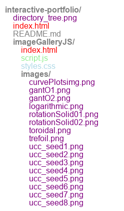

A repository showcasing interactive projects, including an image gallery with JavaScript, hosted on GitHub Pages. 
Features dynamic tools, educational resources, and systems engineering solutions.

https://johnryanzelling.github.io/interactive-portfolio/ 

### About  
- Licensed substitute teacher currently pursuing an MA in Teaching Mathematics (expected 2026).  
- Passionate about systems engineering, data programming, and education technology.  
- Actively working on database programming tools and educational resources.  
- Author of *Math Foundations* and part-time Middle and High School Mathematics teacher.  
- Experienced in oilfield operations, surveying, and technical design.  

---

### Research Interests  
- Mathematics education and personalized learning.  
- Data systems engineering and visualization tools.  
- Applications of generative art in technical communication.  

---

### Education  
- **MA in Teaching Mathematics** (in progress), Valley City State University 2027
- **Certificate in Electrical Engineering Technology**, Pellissippi State Community College 2016
- **M.S. Systems Engineering**, National University 2012  
- **A.S. Building Information Technology**, College of Southern Nevada 2007
- **B.S. Mathematics**, Allegheny College 1999

---

### Professional Positions  
- Substitute Teacher, Williston Middle and High Schools  
- Freelance Hot Oil & Hazmat Chemical Operator  
- City Surveyor Assistant, City of Palo Alto  
- Survey and Engineering Technician, City of North Las Vegas  

---

### Publications and Projects  
- **Book:** *Math Foundations* (Author)  
- **Projects:**  
  - Generative Art Tools  
  - Gantt Chart Visualizations  
  - Interactive Curve Plots  
  - calendar app
  - autoclick app
  - dirTree System app
  - moonPhases app
  - FracData Analysis app

---

### Teaching Experience  
- Middle and High School Mathematics (Williston Schools)  
- Private tutoring in mathematics and technical skills  

---

### Skills & Tools  

#### Programming Languages  
- **Python**  
- **JavaScript**  
- **Mathematica**  
- **R**

#### Markup and Style Sheet Languages  
- **HTML/CSS**  
- **Markdown**  

#### Databases  
- **SQL**  
- **MongoDB**  

#### Version Control  
- **Git**  

#### Data Analysis and Visualization Tools  
- **Matplotlib**  
- **Pandas**  
- **Jupyter Notebooks**  

#### Additional Tools and Frameworks  
- **Docker**  
- **FastAPI**  
- **Flask**  

---

### Field and Laboratory Experience  
- Oilfield operations, including hot oil and hazmat chemical handling.  
- Surveying and engineering design for municipal projects.  
- Data collection and analysis for infrastructure development.  

---

### Languages  
- **English**: Fluent  
- **Spanish**: Conversational  

---

### Some Projects  
- **Generative Art**  
- **Gantt Charts**  
- **Curve Plots**  

## Project Gallery

---

### How to Reach Me  
- **LinkedIn:** [linkedin.com/in/johnryanzelling/](https://www.linkedin.com/in/johnryanzelling/)  
- **GitHub:** [github.com/johnryanzelling](https://github.com/johnryanzelling)  

---

### Note on Projects  
*All repositories are private.*

